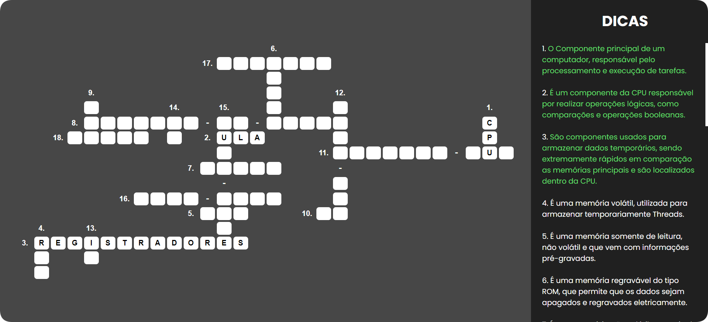

<h1>Crossword Game</h1>

Jogo de palavras cruzadas desenvolvido para a matéria de Arquitetura Computacional na SPTech.

 

## 🚀 Tecnologias utilizadas

 

## 📷 Screenshot

 

## 🔗 URL do jogo

- [Clique aqui para acessar](https://leohsantos.github.io/crossword-game/)